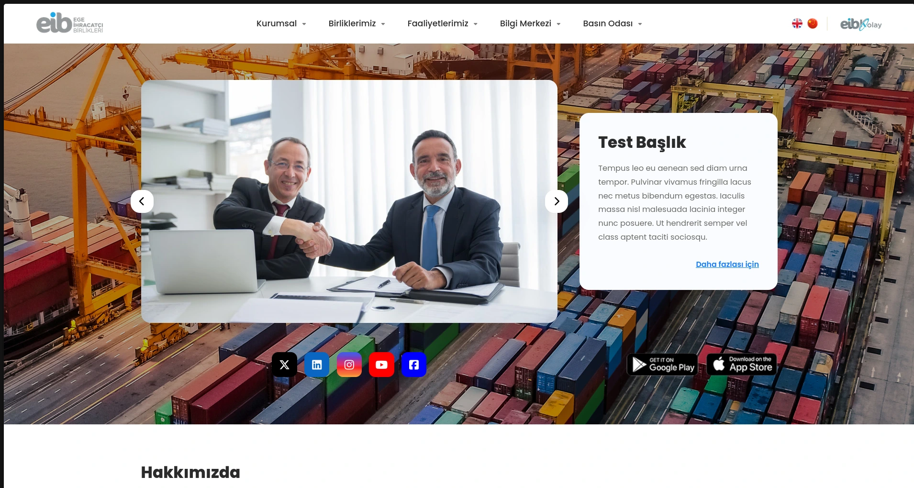
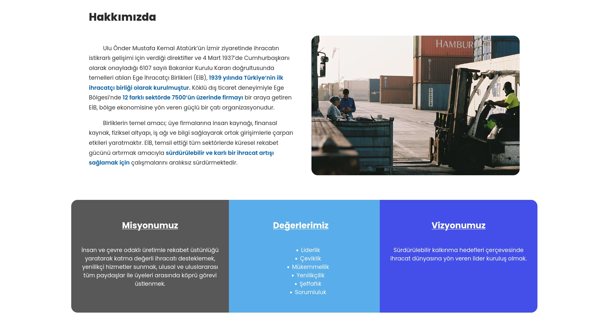
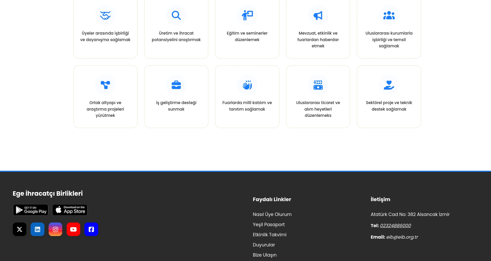
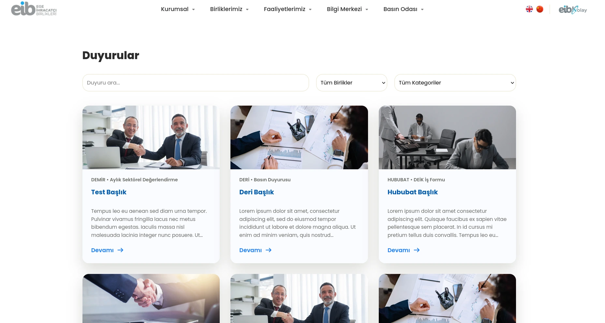
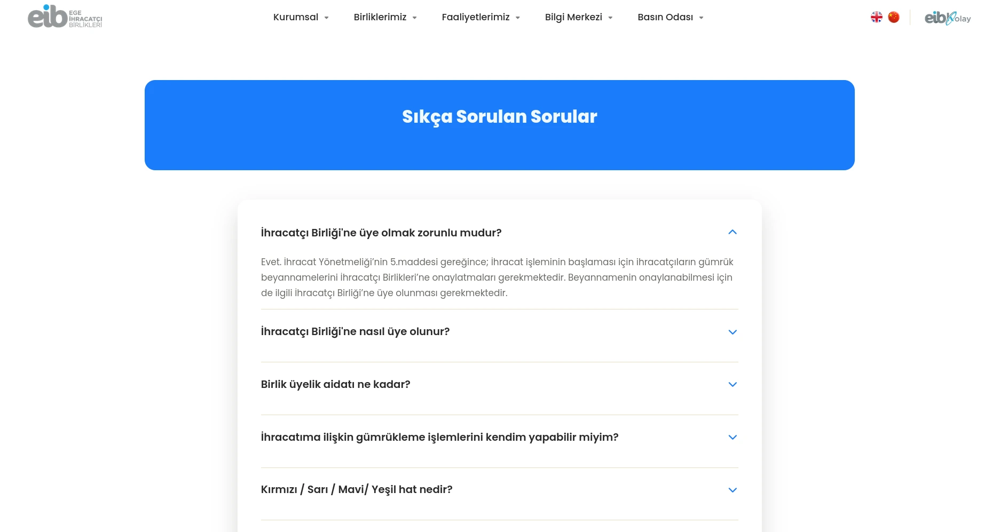

<h1>My version of EIB Website - an Internship Project</h1>

This is my look on EIB (Aegean Exporters' Association)'s main website. Minimalized some parts and gave it some color.

<h2>Tools & Technologies</h2>
<ul>
<li>Spring Boot</li>
<li>PostgreSQL</li>
<li>Canva (wireframe & prototype)</li>
<li>FontAwesome (icons)</li>
<li>Pexels for stock images</li>
</ul>

<h2>Noticable Changes I made</h2>
<ul>
<li>Added a carousel on the home page that contains information about recent news. Every information is stored in database for easy configuration.</li>
<li>Combined the "Görevlerimiz(Our Mission)" and "Tarih(History)" page and turned it into "About Me" on home page. Articles on "Our Mission" are on a seperate section of homepage</li>
<li>Removed search bar</li>
<li>"Vizyon, Misyon ve Değerlerimiz (Our Vision, Mission and Values)" are now on main page.</li>
<li>Long navbar dropdowns are now mega navbars for easier access.</li>
<li>Revamped the Announcement page using AJAX.</li>
<li>Used "details" html tag for FAQ(Sıkça Sorulan Sorular) page.</li>
</ul>

<h2>How to Run the Project</h2>

Add a database called eib-website (or you can customize it including the password based on application.properties file in resources directory)

run the project using ./mvnw spring-boot:run

Enjoy
